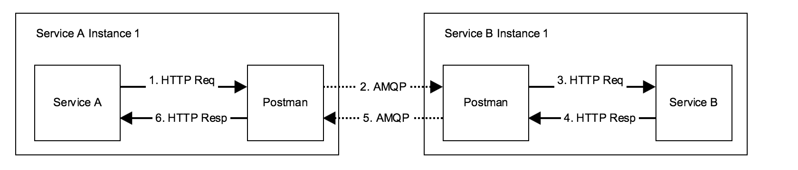

# Postman

[](https://travis-ci.org/rgamba/postman)

Postman is a HTTP to AMQP reverse proxy that combines the ease of
implementing a HTTP API with the benefits of async service communication.

Here is a simple diagram of how Postman works





Most of the HTTP services use a reverse proxy (nginx, Apache, etc) already, right?
Think of *postman* as the async equivalent to those reverse proxies.

REST over HTTP might not be the ideal protocol for internal microservice
communication, but it is certainly the easiest and fastest to implement.

AMQP or any other async protocol might be the best, but it is certainly
not as easy and straight forward to implement as regular HTTP. Plus, many
of our existing services use HTTP already!

**Here's how a typical `Service A -> Service B` request looks like using postman:**

```
+---+---------------+-------------+-------------+-------------+---+
    |               |             |             |             |
    +--------------->             |             |             |
    |1. HTTP request|             |             |             |
    |to service B   +------------->             |             |
    |               |2. Serialize |             |             |
    |               |& send async +------------->             |
    |               |             |3. Send to   |             |
    |               |             |a service B  +------------->
    |               |             |instance     |4. Send HTTP |
    |               |             |             |request to   |
    |               |             |             |service B    |
    |               |             |             |             |
    |               |             |             <-------------+
    |               |             <-------------+5. Send HTTP |
    |               <-------------+6. Serialize |response.    |
    <---------------+7. Send to   |& send async |             |
    |8. Send HTTP   |response     |             |             |
    |response.      |queue        |             |             |
    +               +             +             +             +

Service A        Service A     RabbitMQ      Service B     Service B
                 Postman                     Postman
```

# Installation

To install, just download the appropriate binary from the releases, extract and execute
directly or, preferrably, copy to one dir inside your `PATH`. No other dependencies required.

## Getting started

```bash
postman --config /path/to/config.toml
```

# Compile from source

```bash
go get github.com/rgamba/postman
cd $GOPATH/src/github.com/rgamba/postman
make
```


